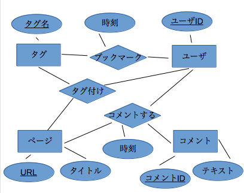

# データベース 第1回レポート
### 1029259152 田中勝也

## (1) あるデータベーススキーマを考え，それをER図で表現せよ．対象とするデータ内容はどのようなものでも良い．

今回，以下の様なデータベーススキーマを考え，それをER図とした．
(下線つきは主キーを表す)

- ユーザ (\underbar{ユーザID})
- ページ (\underbar{URL}, タイトル)
- タグ (\underbar{タグ名})
- コメント (\underbar{コメントID}, テキスト)

- ブックマーク (\underbar{ユーザID}, \underbar{URL}, 時刻)
- タグ付け (\underbar{ユーザID}, \underbar{URL}, \underbar{タグ名})
- コメントする (\underbar{ユーザID}, \underbar{URL}, \underbar{コメントID}, 時刻)

## (2) (1) のデータベーススキーマの内容を日本語で説明すること.

今回考えたデータベーススキーマは，ウェブページに対し，ユーザがブックマークし，
ブックマークしたページに対して，タグやコメントをつけることで，ブックマークを
整理できるという，オンラインブックマークサービスを想定した．

### 各実体・関連についての説明

#### 実体

- ユーザ

    サービスの利用者．主キーはユーザID．ページをブックマークしたり，ブックマークしたページに
    対してタグ付けやコメントを行う．

- ページ

    ウェブページを表す実体．主キーはURL．ユーザへの表示のためにタイトルくらいは持っているべき
    と考えたので，属性としてタイトルを持つようにした．

- タグ

    ユーザがブックマークしたページを分類するためにつける．主キーはタグ名．

- コメント

    ユーザが，ページに対して何かメモをしたりするために書く．主キーはコメントID．
    コメントの内容を表すテキストという属性をもつ．

#### 関連

- ブックマーク

    ユーザがページを後に参照するために保存する．主キーは\{ユーザID，URL\}．
    属性としてユーザがブックマークした時刻を持つ．

- タグ付け

    ユーザがブックマークしたページにタグをつけることで，ブックマークを分類し，管理しやすくする．
    主キーは\{ユーザID，URL，タグ名\}．

- コメントする

    ユーザがブックマークしたページについて追記するために行う．主キーは\{ユーザID，URL，コメントID\}．
    属性としてユーザがブックマークした時刻を持つ．

## (3) (1) のデータベーススキーマを設計する上での設計意図や工夫した点，難しかった点，分からない点などを日本語で説明すること．

また，実際運用する際に，どのような情報が必要になるだろうかということをしっかり考えて実体・関連・属性を決めようとした点で
工夫したが，ER図を作成する際，どれを実体に，どれを関連に分類すればいいのかという判断に慣れておらず，難しかった．
